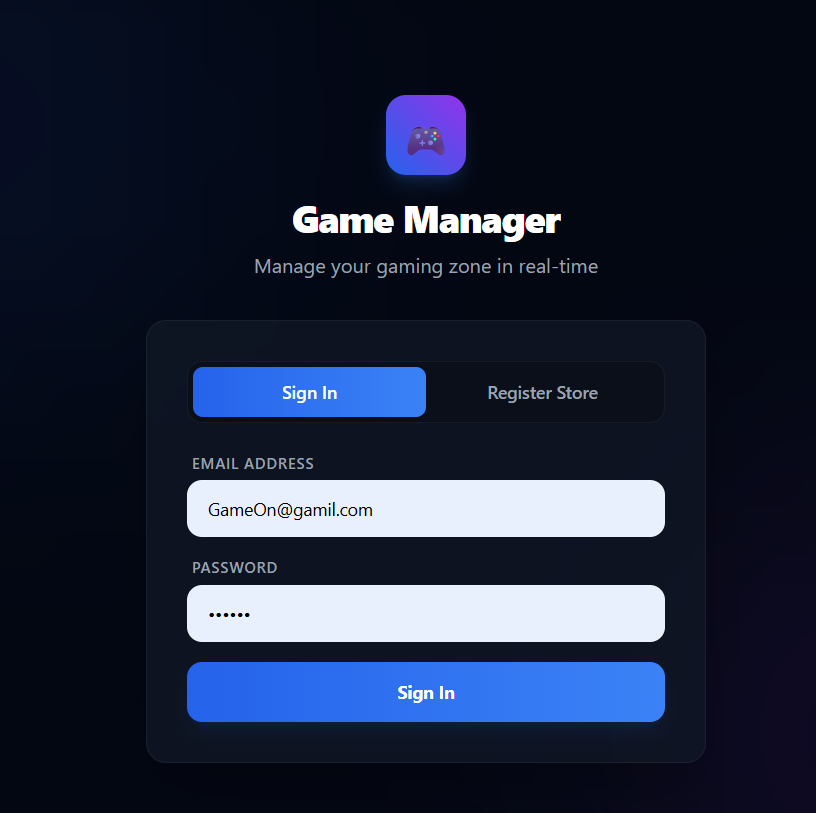
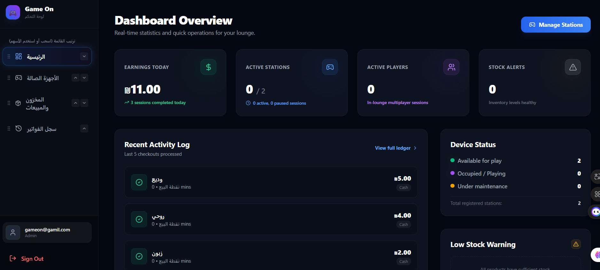
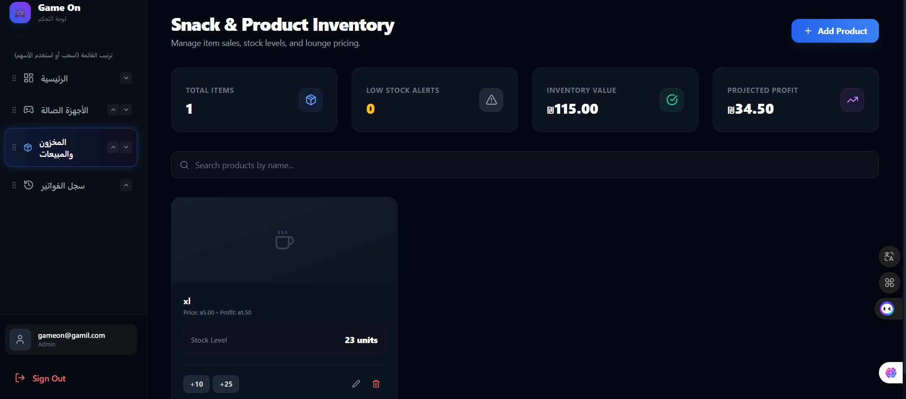
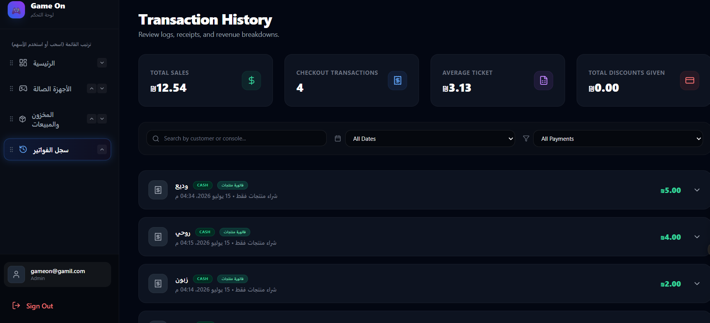
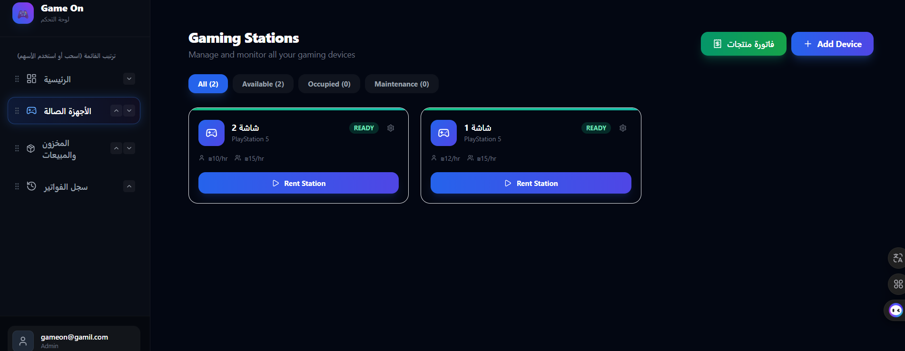

# 🎮 Game Manager SaaS

A modern management system for gaming centers.

Game Manager helps gaming shop owners manage devices, customers, sessions, sales, and inventory from one dashboard.

---
## 🌐 Live Demo

https://game-manager-iota-puce.vercel.app
## 🚀 Features

✅ User authentication  
✅ Dashboard overview  
✅ Gaming devices management  
✅ Session tracking with timers  
✅ Point of Sale (POS) system  
✅ Inventory management  
✅ Role-based access (Admin / Worker)

---

## 🛠 Technologies

### Frontend
- React
- TypeScript
- Vite
- Tailwind CSS

### Backend & Services
- Firebase Authentication
- Firebase Firestore
- Firebase Storage

### Deployment
- Vercel

---

## 📸 Screenshots

### Login

### Dashboard

### inventory

### history

### devices

---

## 📂 Project Structure
src/
├── components/
├── pages/
├── services/
├── store/
└── utils/

---

## 🎯 Goal

Build a complete SaaS solution for gaming centers to simplify daily operations and improve business management.

---

## 👨‍💻 Developer

Rawhe Abu Allan

GitHub:
https://github.com/rawheaboallan2003-ai
